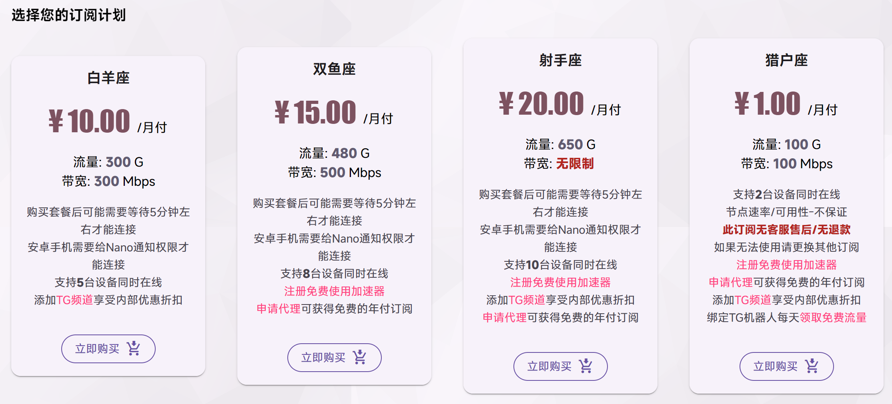

# NanoCloud：4 月封锁后，先试再买的高性价比机场

> 测速快不等于每天都好用。2026 年 4 月，部分中转上游被整体清退，长期运营的快连停止中国大陆业务，一些机场开始涨价或只允许使用官方客户端。NanoCloud 最低 ¥1/月；AFF 注册可试用白羊座 2 天、5G，先用自己的网络验证晚高峰、流媒体和 ChatGPT，再决定是否付费。

 [产品主页](https://nanocloud-release.github.io/NanoCloud/) · [完整文档](https://nanocloud-release.readthedocs.io/zh-cn/latest/)

## 两种注册方式

| 选择 | 注册入口 | 说明 |
| --- | --- | --- |
| AFF 注册 | [注册并试用](https://edu.yuque.men/auth/register?code=KGPt0kjX) | 白羊座 2 天，流量上限 5G |
| 普通注册 | [直接注册](https://edu.yuque.men/auth/register) | 不使用邀请码，无试用承诺 |

邀请码：`KGPt0kjX`。AFF 链接已经包含邀请码，不需要再次填写。

建议在完成试用后再决定是否购买，试用未完成购买会覆盖试用并且未充分测试可能会后悔。若不介意可以下载nanocloud的官方客户端，（基于mihomo内核，与clash verge一样的内核）有更多、更稳定的节点。若不想下载，可以用https://github.com/0xWans/Sub2Clash 转到clash verge中使用（比较折腾，适合对clash有研究的用户）

本页包含 AFF 链接，推荐者会从付费中获得一次性平台返佣，你会获得白羊座2天试用权益，流量上限5G。AFF是吸引客源的计划，不会增加套餐收费，也没有其它隐形代价。两种入口同时公开，是否使用 AFF 由读者决定。

## 套餐与真实边界

*NanoCloud 控制台套餐页，2026 年 7 月 14 日核对。*

| 套餐 | 月付 | 流量 | 带宽 | 设备 | 适合 |
| --- | ---: | ---: | ---: | ---: | --- |
| 猎户座 | ¥1 | 100G | 100Mbps | 2 台 | 临时或备用；不保证速率/可用性，无售后、无退款 |
| 白羊座 | ¥10 | 300G | 300Mbps | 5 台 | 日常主力，也是 AFF 试用对应套餐 |
| 双鱼座 | ¥15 | 480G | 500Mbps | 8 台 | 高流量和多设备 |
| 射手座 | ¥20 | 650G | 不限速 | 10 台 | 家庭共享与重度使用 |

当前购买页只显示月付，年付优惠2个月只需付10个月付价格；TG 频道在法定节假日会发布优惠代码，年付可优惠15%。

## 需求分析

| 需求 | 应该检查什么 | 容易误判的地方 |
| --- | --- | --- |
| ChatGPT 不降智 | 模型是否按账户权益路由、长回答是否截断、地区是否漂移 | IP 只是风控因素之一，账号、设备和浏览器也会影响结果 |
| 少验证码 | 登录 Google、ChatGPT 等服务时是否反复验证 | “原生 IP”“家宽”标签不能保证低风险 |
| 流媒体不卡顿 | 1080p/4K 连续播放、拖动进度条、解锁是否保持 | 峰值测速高不代表单线程和目标服务正常 |
| 晚高峰稳定 | 20:00–23:00 的超时、断流、重连和节点切换 | 白天满速不能代表晚上 |
| 大流量和高速 | 月流量、倍率、带宽、设备数和公平使用规则 | 低价超大流量可能伴随限速或无售后 |
| IP 质量 | ASN、共享人数、历史滥用、地区一致性和稳定性 | 风险评分不能代表，推荐<https://ip.net.coffee/>  <https://meowvps.com/tools/ip-check/> |

作者在中国电信晚高峰的实际使用中，网页打开、流媒体播放和 ChatGPT 长对话保持稳定；这不是全国统一结论。请用下面的 2 天试用在自己的地区复核。

## 2 天 / 5G 怎么测

1. 晚高峰分别使用家庭宽带和手机流量，记录超时、断流和重连。
2. 连续使用 ChatGPT 10–20 分钟，检查模型路由、回答截断和验证码。
3. 播放 1080p 视频并拖动进度条，不用反复跑满速消耗试用流量。
4. 登录常用网站，观察验证码、地区漂移和账号异常提醒。
5. 更新订阅、切换常用地区并重启客户端，确认故障后能恢复。

[查看快速开始与完整试用清单](https://nanocloud-release.readthedocs.io/zh-cn/latest/getting-started/)

## 客户端与附加服务

- 官方客户端支持 Android、Windows 和 macOS，并提供更多长期有效节点。
- 控制台支持 Hiddify Next、Clash Verge、FlClash、Karing 和 sing-box。
- [@NanoAir_bot](https://t.me/NanoAir_bot) 支持购买、获取订阅和每日签到；官方频道称每月签到最多可领取 90G 流量。
- 白羊座及以上套餐支持 Telegram 专用代理。
- 购买后可能需要等待约 5 分钟；Android 需要允许 Nano 发送通知。

订阅链接等同账户凭据，不公开截图，不上传 GitHub，也不粘贴到来源不明的在线转换或测速网站。

## 先看现在发生了什么

- **4 月 2 日**：[LinuxDo 转发的机场运维公告](https://linux.do/t/topic/1881437) 称，部分被通报的国内中转上游和机房被整体拔线，临时改用直连节点。
- **4 月 7 日**：[奶昔公告截图](https://linux.do/t/topic/1875969) 以能源和带宽成本上涨为由，全线涨价 5%。
- **4 月 25 日**：社区用户记录到一些机场限制第三方订阅，改用官方客户端保护订阅和节点信息，但客户端功能与可测试性也可能受限。[查看讨论](https://linux.do/t/topic/2052417/77)。
- **4 月 28 日**：[长期运营的快连宣布终止中国大陆业务](https://www.keeplets.net/blog/c130bd)；5 月的“恢复运营”只面向全球标准机制，不代表大陆服务恢复。

这不等于所有机场和线路都已经失效，但说明“老牌”“专线”和年付优惠都不能代替当前状态。新用户更适合试用或月付，刚需用户应准备不同线路的备用服务。

[查看完整的 2026 网络现状](https://nanocloud-release.readthedocs.io/zh-cn/latest/network/)

## 与自建成本放在一起看

按 2026 年 7 月 13 日参考汇率 `1 USD = 6.7776 CNY`：

<!-- markdownlint-disable MD013 -->

| 方案 | 公开基础成本 | 得到什么 | 主要代价 |
| --- | ---: | --- | --- |
| NanoCloud | ¥1–20/月 | 多地区节点、100–650G/月、2–10 台设备同时在线、低维护 | 共享出口，不是固定或独享 IP |
| 单台主流 VPS 自建 | 约 ¥33.89–40.67/月 | 独立实例、单地区、约 1TB 流量 | 自己维护；IP 或线路被封后要换 IP，或另购机场作入口 |
| 两台 $5 VPS 自建中转 | 约 ¥67.78/月 | 入口和落地可分开 | 两个故障点，仍不等于优化或专线 |
| 机场 + 商业宽带 IP 落地 | ¥17.94–36.94/月 | 机场负责传输，$2.5/月的商业宽带 IP 提供落地 | 商业宽带 IP 落地 |
| IPLC/IEPL | 通常询价，价格高昂 | 跨境段避开普通公网 | 按线路和带宽询价 |

<!-- markdownlint-enable MD013 -->

自建适合需要固定出口、控制权和账号环境一致性的用户；机场更适合低预算、大流量、多地区和不愿维护服务器的用户。需要 AI 独立出口但又重视传输质量时，可以用机场节点作为入口，再接自己的 VPS 或商业宽带 IP 落地。按本页汇率，白羊座加 $2.5/月落地约为 ¥26.94/月。

[查看方案与成本详细说明](https://nanocloud-release.readthedocs.io/zh-cn/latest/testing/)

> **产品边界：** NanoCloud 是共享代理服务，不等同于固定住宅 IP、独享 IP 或企业 SLA。套餐、节点和优惠会变化，付款前以控制台为准。

## 更多入口

- [产品主页](https://nanocloud-release.github.io/NanoCloud/)
- [按需求选择](https://nanocloud-release.readthedocs.io/zh-cn/latest/buying/)
- [常见问题排查](https://nanocloud-release.readthedocs.io/zh-cn/latest/troubleshooting/)
