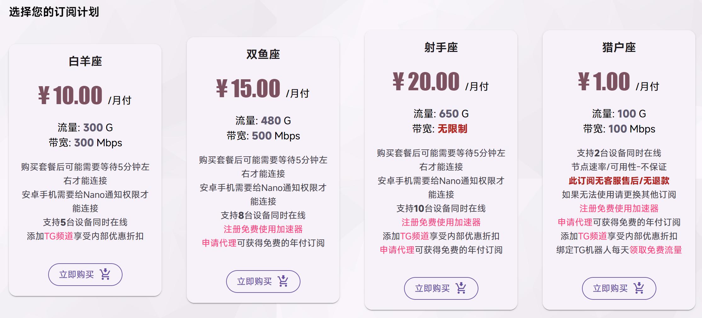
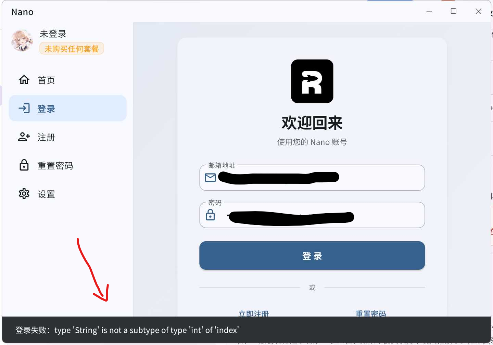
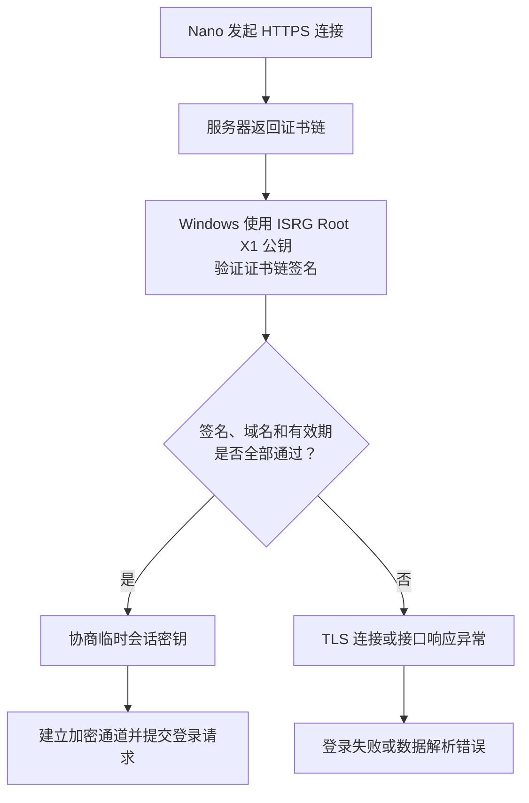

# NanoCloud 机场：1 元起、2 天 5G 试用与客户端指南

NanoCloud 的月付从 ¥1 起，最贵一档 ¥20；四档套餐分别提供 100–650G 流量，可同时连接 2–10 台设备。想先看看自己的线路是否合适，可以通过 AFF 入口领取白羊座 2 天 / 5G 试用。注册、客户端、节点区别、测试方法和排障都整理在下面。


 [Pages 指南](https://nanocloud-release.github.io/NanoCloud/) · [选购与测试](https://nanocloud-release.github.io/NanoCloud/#buying)

## NanoCloud 注册入口与独立指南


| 入口 | 地址 | 用途 |
| --- | --- | --- |
| AFF 注册 | [注册并试用](https://edu.yuque.men/auth/register?code=KGPt0kjX&utm_source=github&utm_medium=readme&utm_campaign=nanocloud_trial) | 白羊座 2 天试用，流量上限 5G |
| 普通注册 | [直接注册](https://edu.yuque.men/auth/register) | 不使用邀请码 |
| Pages 指南 | [NanoCloud 机场介绍](https://nanocloud-release.github.io/NanoCloud/) | 套餐、客户端、教程和排障 |
| 教程频道 | [NanoCloudWiki](https://t.me/NanoCloudWiki) | 客户端下载与使用教程 |
| Telegram Bot | [@NanoAir_bot](https://t.me/NanoAir_bot) | 购买、订阅、签到与反馈 |

AFF 入口已带邀请码 `KGPt0kjX`。通过它注册，推荐者可能收到平台返佣，你会拿到白羊座 2 天 / 5G 试用，套餐价格不变，（我太弱了，没有议价的能力）；不想使用邀请码就用普通注册入口。

建议先把试用跑完再购买。试用期间购买会直接覆盖剩余试用时间，几个关键场景还没测完就付款，之后可能后悔。
下载nanocloud的官方客户端，（基于mihomo内核，与clash verge一样的内核）有更多、更稳定的节点。若不想下载，也可以导入自己在用的代理软件。
可以通过 https://github.com/0xWans/Sub2Clash 将官方客户端的节点（不过也需要下载客户端才行）转到clash verge中使用。这个方法比较折腾，更适合熟悉 Clash 配置、也会用 AI 辅助排错的用户。


## NanoCloud 能提供什么

- ¥1–20 月付，四档套餐覆盖 100–650G 月流量。
- 控制台可见香港、东京、新加坡和美国西部等地区，协议包括 VLESS、TUIC 和 Hysteria。
- 官方客户端支持 Android、Windows 和 macOS；已有客户端也可以一键导入 Hiddify Next、Clash Verge、FlClash、Karing 或 sing-box。
- 官方客户端基于开源内核，能看到更多长期有效节点。
- [@NanoAir_bot](https://t.me/NanoAir_bot) 可用于购买、获取订阅和每日签到（每月高达90G）和工单反馈；白羊座及以上套餐另有 Telegram 专用代理。

## 套餐价格



*截图来自 NanoCloud 控制台，核对时间为 2026 年 7 月 14 日。*

| 套餐 | 月付 | 流量 | 带宽 | 设备 | 适合 |
| --- | ---: | ---: | ---: | ---: | --- |
| 猎户座 | ¥1 | 100G | 100Mbps | 2 台 | 临时或备用；不保证速率/可用性，无售后、无退款 |
| 白羊座 | ¥10 | 300G | 300Mbps | 5 台 | 日常主力，也是试用对应套餐，购买后可退款 |
| 双鱼座 | ¥15 | 480G | 500Mbps | 8 台 | 高流量和多设备，可退款 |
| 射手座 | ¥20 | 650G | 不限速 | 10 台 | 家庭共享与重度使用，可退款 |

当前购买页只显示月付，年付按 10 个月的月付价格结算；法定节假日前后可以留意Telegram 频道的活动代码，使用促销代码可优惠15%（优惠只支持年付）。


## 客户端与节点类型

### 客户端选择

| 使用方式 | 支持平台或客户端 | 特点 |
| --- | --- | --- |
| NanoCloud 官方客户端 | Android、Windows、macOS | 配置省事，节点也更完整 |
| 控制台一键导入 | Hiddify Next、Clash Verge、FlClash、Karing、sing-box | 继续用自己熟悉的客户端 |
| 本地转换 | [Sub2Clash](https://github.com/0xWans/Sub2Clash) | 给熟悉 Clash 配置的高级用户，综合上述优势 |

### “通用”与“流量”节点

- **通用节点：** 走 IPv4，大多数家庭宽带和手机流量可以直接使用。
- **流量节点：** 走 IPv6，光猫、路由器、运营商、设备和客户端缺一环没开IPv6都会导致timeout。

第一次连接先选“通用”节点，没有配置过设备和软件的IPv6 “流量”节点一般都超时。

## 快速开始与 2 天试用

1. 用 AFF 试用或普通入口注册，然后进入控制台。
2. 不想配置就下载官方客户端；已有客户端则点“一键导入”。
3. 第一次试用或者购买可能需要等待片刻（5分钟或快或慢），才能联通服务器，之前节点一般测试全红。
4. 第一次先连“通用”节点，随手打开几个常用网页。（或者直接在软件内测试延时）
5. 最后留到晚高峰，测试 AI、流媒体、登录网站和故障恢复。

### 把 5G 试用流量用在关键测试上

| 测试 | 建议方法 | 重点观察 |
| --- | --- | --- |
| 晚高峰 | 18:00–24:00 使用家庭宽带和手机流量 | 超时、断流和重连 |
| ChatGPT | 连续对话 10–20 分钟 | juice测试结果、思考时长、长回答、登录、验证码和地区 |
| 流媒体 | 连续播放 1080p，并多次拖动进度条 | 缓冲时间 |
| 登录类网站 | 登录常用 Google、AI 或社交账户（twitter、linuxdo、discord、reddit） | 验证次数、识别国家和登录状态 |
| 故障恢复 | 更新订阅、切换节点并重启客户端 | 恢复步骤和耗时 |

## 常见问题速查

| 现象 | 先做什么 |
| --- | --- |
| 手机流量能用，家庭 Wi-Fi 不能用 | 切到“通用”节点，再检查光猫和路由器的 IPv6 |
| 白天正常，晚上断流 | 在 20:00–23:00 记录超时和重连，并用手机流量交叉测试 |
| 节点全部变红 | 查看控制台状态、更新订阅、检查到期时间和剩余流量 |
| 客户端初始化失败 | 卸载旧版、重启设备，再从控制台提供的入口安装 |
| 关掉客户端后无法联网 | 清除系统代理，必要时使用 Windows“网络重置” |

[打开 Pages 上的完整排查步骤](https://nanocloud-release.github.io/NanoCloud/#troubleshooting)

### 为什么要安装证书

Windows 版 Nano 登录时如果出现下面的错误，客户端可能没有成功建立完整的 HTTPS 信任链：

```text
登录失败：type 'String' is not a subtype of type 'int' of 'index'
```



安装教程提供的 `https_windows.crt` 后，Windows 可以使用其中的 `ISRG Root X1` 公钥验证 Nano 登录服务器的证书链。证书在 HTTPS 连接中的作用如下：


```mermaid
flowchart TD
    A["Nano 发起 HTTPS 连接"] --> B["服务器返回证书链"]
    B --> C["Windows 使用 ISRG Root X1 公钥<br/>验证证书链签名"]
    C --> D{"签名、域名和有效期<br/>是否全部通过？"}
    D -->|"是"| E["协商临时会话密钥"]
    E --> F["建立加密通道并提交登录请求"]
    D -->|"否"| G["TLS 连接或接口响应异常"]
    G --> H["登录失败或数据解析错误"]
```

### 安装这个证书有危害吗，会被 MITM 吗？

**安全结论：**经核验，教程中的 `https_windows.crt` 是 Let’s Encrypt 的公开根证书 `ISRG Root X1`。文件只包含证书和公钥，不包含根 CA 私钥。Nano 无法仅凭这个文件签发任意网站的假证书，也无法用它解密 HTTPS 流量。

真正的 MITM 抓包需要抓包程序掌握自建 CA 的私钥、让设备信任该自建 CA，并处于流量转发路径上。Burp Suite、Charles、Fiddler 和 mitmproxy 安装的通常是由抓包程序自己控制私钥的 CA，这与公开的 `ISRG Root X1` 根证书不同。

<details>
<summary><strong>为什么会是这样的</strong></summary>

截图中的 `type 'String' is not a subtype of type 'int' of 'index'` 是客户端数据类型解析错误。客户端原本可能预期接口返回数组、数字索引或特定 JSON 结构，实际却收到了字符串或其他异常内容。TLS 信任链不完整、网络拦截、服务器异常和客户端兼容性问题都可能产生这种现象，所以这条错误本身不能证明证书缺失是唯一原因。

`ISRG Root X1` 是 Internet Security Research Group 运营、供 Let’s Encrypt 证书体系使用的公开信任锚。它的作用是让客户端使用根证书中的公钥验证证书链签名，确认服务器证书最终来自受信任的 CA。根证书不提供 HTTPS 会话的解密密钥；会话密钥由客户端与服务器在每次连接中临时协商，不能从根证书公钥反推出。

签发可被系统接受的假网站证书需要根 CA 或受信任中间 CA 的私钥。教程证书中没有 `ISRG Root X1` 私钥，Nano 因而不能用它为 Google、银行或其他网站动态签发替代证书。抓包软件则会自行生成 CA 和私钥，把自己的 CA 加入系统信任库，再分别与客户端和真实服务器建立两条加密连接。

核验指纹：`ISRG Root X1` 的 SHA-256 证书指纹为 `96BCEC06264976F37460779ACF28C5A7CFE8A3C0AAE11A8FFCEE05C0BDDF08C6`。上述结论只适用于指纹一致的证书文件，不代表其他来源不明的根证书也可以安全安装。

</details>

## 需求分析

| 主要需求 | 优先检查 | 误区 |
| --- | --- | --- |
| ChatGPT 稳定使用 | 模型是否按账户权益路由、长回答是否截断、地区是否漂移 | IP 只是风控因素之一，账号、设备和浏览器也会影响结果 |
| 少验证码 | 登录 Google、ChatGPT 等服务时是否反复验证 | IP风险分数、“原生 IP”、“家宽”标签不能保证低风险 |
| 流媒体不卡顿 | 1080p/4K 连续播放、拖动进度条检测卡顿 | 峰值测速高不代表单线程和目标服务正常 |
| 晚高峰稳定 | 18:00–23:00 的超时、断流、重连 | 白天满速不能代表晚上 |
| 大流量和高速 | 流量、倍率、带宽、设备数 | 低价超大流量可能伴随限速或无售后，节点总数多不一定实际多，名字相近的节点可能是一个vps进行多个入口分流 |
| IP 质量 | ASN、共享人数、历史滥用、地区一致性和稳定性 | 虽然风险评分不能代表，但有必要测试看看，推荐<https://ip.net.coffee/>  <https://meowvps.com/tools/ip-check/> |

目前记录的实测环境是中国电信晚高峰，网页、流媒体和 ChatGPT 长对话都能稳定使用，陕西、浙江电信已知稳定。换了地区或运营商，结果可能不同，2 天试用正好可以自己跑一遍。


## 2026 年网络变化

2026 年 4 月，多家服务商调整中转上游、涨价，或把更多节点放进官方客户端；
长期运营的快连也停止了中国大陆业务。对新用户来说，先试用再月付，比只看运营年限和测速图更实用。经常依赖代理服务的人还需要留一条备用线路。

| 日期 | 事件 |
| --- | --- |
| 4 月 2 日 | [LinuxDo 转发的运维公告](https://linux.do/t/topic/1881437)提到部分中转上游和机房被清退 |
| 4 月 7 日 | [奶昔公告截图](https://linux.do/t/topic/1875969)显示全线涨价 5% |
| 4 月 25 日 | [社区讨论](https://linux.do/t/topic/2052417/77)记录部分机场向官方客户端集中更多节点 |
| 4 月 28 日 | [快连宣布停止中国大陆业务](https://www.keeplets.net/blog/c130bd) |


## 与自建成本比较

按 2026 年 7 月 13 日参考汇率 `1 USD = 6.7776 CNY`：

<!-- markdownlint-disable MD013 -->

| 方案 | 公开基础成本 | 得到什么 | 主要代价 |
| --- | ---: | --- | --- |
| NanoCloud | ¥1–20/月 | 多地区节点、100–650G/月、2–10 台设备同时在线、低维护 | 共享出口，不是固定或独享 IP |
| nanocloud + 2.5$ 商业宽带 IP 落地 | ¥17.94–36.94/月 | 机场负责传输，$2.5/月的商业宽带 IP 提供落地 | 机场和商业宽带IP链式代理造成的高延迟，为落地IP自动选择机场入口需要一定折腾量和所属的代理内核的配置知识，不过现在AI可帮忙，配置完毕，基本不需要维护 |
| 单台主流 VPS 自建 | 约 ¥33.89–40.67/月 | 独立实例、单地区、约 1TB 流量 | 自己维护；IP 或线路被封后要自己维护，维护量很高 |
| 两台 $5 VPS 自建中转 | 约 ¥67.78/月 | 入口和落地分离 | 维护量很高 |
| IPLC/IEPL专线或中转 | 不确定，通常高昂 | 高速、稳定 | 价格通常是直连机场5倍 |

<!-- markdownlint-enable MD013 -->

自建适合需要固定出口、控制权和账号环境一致性的用户；机场更适合低预算、大流量、多地区和不愿维护服务器的用户。需要 AI 独立出口但又重视传输质量时，可以用机场节点作为入口，再接自己的 VPS 或商业宽带 IP 落地，机场订阅费用+落地IP费用。

## 来源与更新

- 套餐、节点和客户端：NanoCloud 控制台，2026 年 7 月 14 日核对。
- [AWS Lightsail Pricing](https://aws.amazon.com/lightsail/pricing/)
- [DigitalOcean Droplet Pricing](https://www.digitalocean.com/pricing/droplets)
- [Vultr Plans API](https://api.vultr.com/v2/plans?type=vc2&per_page=100)
- [Akamai Cloud Linode Types API](https://api.linode.com/v4/linode/types?page_size=100)
