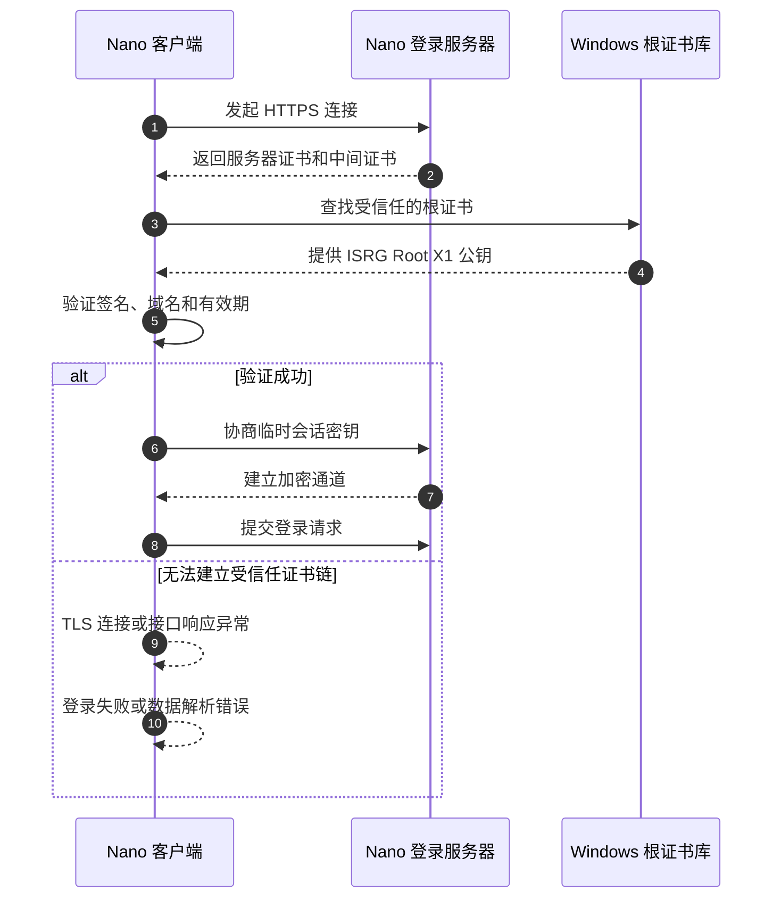

# NanoCloud 机场：1 元起、2 天 5G 试用与客户端指南

NanoCloud 的月付从 ¥1 起，最贵一档 ¥20；四档套餐分别提供 100–650G 流量，可同时连接 2–10 台设备。
想先看看自己的线路是否合适，可以通过 AFF 入口领取白羊座 2 天 / 5G 试用。
注册、客户端、节点区别、测试方法和排障都整理在下面。


## NanoCloud 能提供什么

- 四档套餐 100（100Mbps）、300（300Mbps）、480（500Mbps）、650G（不限速） 月流量。
- 香港、东京、新加坡和美国西部等地区节点，协议包括 VLESS 、TUIC 和 Hysteria2，以及mieru。
- 官方客户端需要跟着教程配置，但不需要clash verge一样进行复杂配置。小白和不想折腾的用户福音。
- [@NanoAir_bot](https://t.me/NanoAir_bot) 可用于购买、获取订阅和每日签到（每月高达90G）和工单反馈；
- 白羊座及以上套餐另有 Telegram 专用代理。
- 详细的文档
- 官网直连，无需代理即可获取配置。

## NanoCloud不提供什么

- 家宽
- IELP/IPLC
- 中转

## NanoCloud 注册入口与[独立指南](https://nanocloud-release.github.io/NanoCloud/)

| 入口 | 地址 | 用途 |
| --- | --- | --- |
| AFF 注册 | [试用注册](https://edu.yuque.men/auth/register?code=KGPt0kjX) | 白羊座套餐 5GB流量  2 天试用 |
| 普通注册 | [直接注册](https://edu.yuque.men/auth/register) | 不使用邀请码 |
| Pages 指南 | [NanoCloud 机场介绍](https://nanocloud-release.github.io/NanoCloud/) | 套餐、客户端、教程和排障 |
| 教程频道 | [NanoCloudWiki](https://t.me/NanoCloudWiki) | 客户端下载与使用教程 |
| Telegram Bot | [@NanoAir_bot](https://t.me/NanoAir_bot) | 购买、订阅、签到与反馈 |


邀请码 `KGPt0kjX`。通过它注册，推荐者可能收到平台返佣，你会拿到白羊座 2 天 / 5G 试用，套餐价格不变；不想使用邀请码就用普通注册入口，但我不确定是否有试用。

建议先把试用用完再购买，**试用期间购买配置会直接覆盖剩余试用时间和流量**。
下载nanocloud的官方客户端，安装证书，有更多、更稳定的节点。猎户座开源客户端能导入27个节点，官方端有54个节点。射手座开源客户端46节点，官方端81个。不同套餐订阅节点不同。（官方客户端支持 Android、Windows 和 macOS，基于mihomo内核，与clash verge一样的内核，我猜的。）
注意事项：①查看[使用文档](https://edu.yuque.men/app/knowledge)-对应平台的nano教程。Windows上需要在电脑上导入教程中下载的公开证书，才能正常登录使用官方客户端。
若不想下载，也可以让AI agent使用<https://github.com/0xWans/Sub2Clash> 项目解密后再导入自己在用的代理软件。这个方案也需要下载客户端和证书。不过这个方案获取到节点信息不利于机场主保护节点，可能会随着保护措施升级而失效。但是用户自由度高啊，链式、自定义配置、自定义分流等进阶方案都要用到开源客户端。
总之用不用就看需求，有需求才有解决方案。

## 如何判断自己需要的客户端
需求

## 套餐配置和价格


*截图时间为 2026 年 7 月 14 日。*

| 套餐 | 月付 | 流量 | 带宽 | 设备 | 适合 |
| --- | ---: | ---: | ---: | ---: | --- |
| 猎户座 | ¥1 | 100G | 100Mbps | 2 台 | 临时或备用；不保证速率/可用性，无售后、无退款 |
| 白羊座 | ¥10 | 300G | 300Mbps | 5 台 | 日常主力，也是试用对应套餐，购买后可退款 |
| 双鱼座 | ¥15 | 480G | 500Mbps | 8 台 | 高流量和多设备，可退款 |
| 射手座 | ¥20 | 650G | 不限速 | 10 台 | 家庭共享与重度使用，可退款 |

当前购买页只显示月付，年付按 10 个月的月付价格结算；法定节假日前后可以留意Telegram 频道的活动代码，使用促销代码可优惠15%（优惠只支持年付）。


## 客户端与节点类型

### 客户端选择

| 使用方式 | 支持平台或客户端 | 特点 |
| --- | --- | --- |
| NanoCloud 官方客户端 | Android、Windows、macOS | 配置省事，节点也更完整，猎户座55个 |
| 控制台一键导入 | Hiddify Next、Clash Verge、FlClash、Karing、sing-box | 继续用自己熟悉的客户端，猎户座27个 |
| 本地转换 | [Sub2Clash](https://github.com/0xWans/Sub2Clash) | 给熟悉 Clash 配置的高级用户，综合上述优势 |

### “通用”与“流量”节点

- **通用节点：** 走 IPv4，大多数家庭宽带和手机流量可以直接使用。
- **流量节点：** 走 IPv6，一般手机流量能联通，电脑需要光猫、路由器、运营商、设备和客户端每个环节都开IPv6，否则显示timeout（超时，无法联通）。

## 快速开始与 2 天试用

1. 用 AFF 试用注册，然后进入控制台。
2. 没有代理客户端则点击APP下载，下载官方客户端；已有客户端则点“一键导入”。
    查看[使用文档](https://edu.yuque.men/app/knowledge)-对应平台的nano教程。Windows上需要在电脑上导入教程中下载的公开证书，(如对安装公开的安全证书有顾虑请看[为什么要装证书，安装公开证书危险吗](https://nanocloud-release.github.io/NanoCloud/#troubleshooting))才能正常登录使用官方客户端。
3. 第一次试用或者购买可能需要等待片刻（5分钟或快或慢），才能联通服务器，之前节点一般测试timeout。
4. 第一次先连“通用”节点，随手打开几个常用网页。（或者直接在软件内测试延时）
5. 开始测试：最后留到晚高峰，测试 AI、流媒体、登录网站和故障恢复。
6. to be contimue


### 把 5G 试用流量用在关键测试上

| 测试 | 建议方法 | 重点观察 |
| --- | --- | --- |
| 晚高峰 | 18:00–24:00 使用家庭宽带和手机流量 | 超时、断流和重连 |
| ChatGPT | 连续对话 10–20 分钟 | juice测试结果、思考时长、长回答、登录、验证码和地区 |
| 流媒体 | 连续播放 1080p，并多次拖动进度条 | 缓冲时间 |
| 登录类网站 | 登录常用 Google、AI 或社交账户（twitter、linuxdo、discord、reddit） | 验证次数、识别国家和登录状态 |
| 故障恢复 | 更新订阅、切换节点并重启客户端 | 恢复步骤和耗时 |

### 观察方法与工具。

| 方法 | 能观察什么 | 是否需要节点权限 | 测试网站或教程 |
| --- | --- | --- | --- |
| 客户端配置检查 | 节点地址、端口、协议、SNI、传输方式、当前选中节点 | 否 | [NanoCloud 使用文档](https://edu.yuque.men/app/knowledge) |
| 出口 IP 识别 | 实际出口 IPv4/IPv6、ASN、运营商、注册网段、GeoIP | 否 | [IPPure](https://ippure.com/)、[IPLark](https://iplark.com/)、[MeowVPS IP Check](https://meowvps.com/tools/ip-check/) |
| 基础连通测试 | DNS 解析、TCP/UDP 可达性、TLS/QUIC 握手时间 | 否 | [BrowserLeaks SSL](https://browserleaks.com/ssl)、[DNS Leak Test](https://www.dnsleaktest.com/) |
| Ping 测试 | 往返延迟、抖动、丢包；但很多节点禁 ICMP | 否 | [Windows Test-Connection](https://learn.microsoft.com/powershell/module/microsoft.powershell.management/test-connection) |
| Traceroute / NextTrace | 本地主机到入口或出口 IP 的逐跳路径、跨网情况 | 否 | [NextTrace](https://github.com/nxtrace/NTrace-core) |
| MTR 持续测量 | 各跳长期延迟、抖动和丢包趋势 | 否 | [NextTrace MTR 模式](https://github.com/nxtrace/NTrace-core) |
| 实际代理请求 | 网页访问成功率、首字节时间、DNS 泄漏、IPv6 支持 | 否 | [IPLeak](https://ipleak.net/)、[BrowserLeaks IP](https://browserleaks.com/ip) |
| 吞吐量测试 | 单线程/多线程下载、上传、峰值与持续速度 | 否 | [Cloudflare Speed Test](https://speed.cloudflare.com/)、[Fast.com](https://fast.com/) |
| 负载延迟测试 | 下载或上传满载时，延迟和丢包增加多少 | 否 | [Waveform Bufferbloat Test](https://www.waveform.com/tools/bufferbloat) |
| 长期定时观察 | 可用率、故障时段、延迟分位数、出口 IP 变化 | 否 | [Uptime Kuma](https://github.com/louislam/uptime-kuma) |
| 外部测点观察 | 从不同国家、运营商或 Looking Glass 看节点路由 | 否 | [Globalping](https://globalping.io/) |
| BGP/RPKI 查询 | IP 宣告 ASN、上游关系、路由变更、RPKI 状态 | 否 | [BGP.Tools](https://bgp.tools/)、[RIPEstat](https://stat.ripe.net/) |

## 常见问题速查
未登录也可在[官网](https://edu.yuque.men/auth/register?code=KGPt0kjX)右下角的对话24小时AI智能解惑
登录查看 [NanoCloud 官方使用文档](https://edu.yuque.men/app/knowledge)，选择对应系统和 Nano 客户端教程。

Windows 客户端仅支持 Windows 10 及以上系统。安装或排查前，先彻底退出其他代理、VPN 和可能拦截网络驱动的安全软件，避免多个工具同时接管系统代理或虚拟网卡。若临时关闭防火墙或安全防护，处理完成后应重新开启。

| 现象 | 按教程怎么处理 |
| --- | --- |
| 安装程序提示“Windows 已保护你的电脑” | 确认安装包来自官方教程，然后点击“更多信息”→“仍要运行” |
| 初始化失败：无法连接服务器 | 下载并安装教程中的 `https_windows.crt`，重启 Nano；仍失败时，连接手机热点或换一个网络后再启动 |
| 登录时报 `String` 不能作为 `int` 索引 | 先按下方证书说明核对并安装 `https_windows.crt`；这可能修复 TLS 信任链问题，但该报错也可能来自服务器响应或客户端兼容性 |
| 提示缺少 `vcruntime140.dll` | 安装教程提供的 Microsoft Visual C++ 运行库，再重新启动客户端 |
| 提示“权限不足”或缺少 VPN 权限 | 卸载其他代理和冲突的安全软件并重启电脑，重新安装 Nano 时选择“为所有用户安装”，安装后右键“以管理员身份运行” |
| 只有浏览器能联网，Steam、Telegram 或模拟器不能用 | 在设置中把连接模式切换为“虚拟网卡”，断开后重新连接；该模式需要管理员权限并接管电脑全部流量 |
| 部分网站打不开 | 把路由模式从“自动”切换为“全局”，断开后重新连接；全局模式会增加流量消耗，也可能拖慢国内网站 |
| 国内网站打开变慢 | 把路由模式恢复为“自动”；该模式只代理需要代理的站点，通常更适合日常使用 |
| 换成手机热点能用，家庭 Wi-Fi 不能用 | 先用“通用”节点，再检查家庭网络、光猫和路由器的 IPv6 或 DNS 设置 |

[打开 Pages 上的完整排查步骤](https://nanocloud-release.github.io/NanoCloud/#troubleshooting)

<details>
<summary><strong>无法登录官方客户端的解决方法</strong></summary>


Windows 版 Nano 登录时如果出现下面的错误，客户端可能没有成功建立完整的 HTTPS 信任链：

```text
登录失败：type 'String' is not a subtype of type 'int' of 'index'
```

按照 [NanoCloud 官方使用文档](https://edu.yuque.men/app/knowledge) 中的 Windows Nano 教程安装 `https_windows.crt` 后，Windows 可以使用其中的 `ISRG Root X1` 公钥验证 Nano 登录服务器的证书链。证书和公钥的作用是验证对方服务器身份并建立受信任的 HTTPS 连接；连接成功后，客户端才能访问登录接口。

<details>
<summary><strong>查看完整的 HTTPS 证书验证流程</strong></summary>


```mermaid
sequenceDiagram
    autonumber
    participant N as Nano 客户端
    participant S as Nano 登录服务器
    participant R as Windows 根证书库

    N->>S: 发起 HTTPS 连接
    S-->>N: 返回服务器证书和中间证书
    N->>R: 查找受信任的根证书
    R-->>N: 提供 ISRG Root X1 公钥
    N->>N: 验证签名、域名和有效期
    alt 验证成功
        N->>S: 协商临时会话密钥
        S-->>N: 建立加密通道
        N->>S: 提交登录请求
    else 无法建立受信任证书链
        N-->>N: TLS 连接或接口响应异常
        N-->>N: 登录失败或数据解析错误
    end
```

</details>

## 为什么安装 ISRG Root X1 不会让 NanoCloud 具备 HTTPS 解密或 MITM 能力

### 核心原因
ISRG Root X1 是由公开可信机构（Internet Security Research Group）发布的根证书。

NanoCloud **不持有该证书对应的私钥**，因此无法伪造或签发任何能通过 Windows 验证的 HTTPS 证书。

该证书文件本身只包含**公开信息和公钥**，任何人都可以下载。真正用于签发网站证书的是 ISRG 的根 CA 私钥，由机构严格保管，不会随证书文件分发，也不会因用户安装证书而泄露给 NanoCloud。

安装 ISRG Root X1 的作用只是：将 Let's Encrypt 的根证书加入 Windows 信任库，使系统能够验证由该体系签发的网站证书是否真实有效。

### HTTPS 连接时发生了什么

当浏览器访问 HTTPS 网站时：
1. 网站发回自己的 HTTPS 证书。
2. Windows 使用已安装的 `ISRG Root X1` 公钥检查证书链、域名和有效期。
3. 验证通过后，浏览器与网站协商临时会话密钥，并建立 TLS 加密连接。
4. 后续数据全部加密传输。

**根证书的作用只是“验证身份”**，确保你连接的是正确的网站，而不是中间人。

因此，在没有额外解密机制的情况下：
- 浏览器 ↔ 真实网站之间建立加密连接
- NanoCloud 只能转发加密流量
- 可见信息仅包括：连接时间、流量大小、目标 IP 等
- 无法读取 HTTPS 内容

### 与抓包工具根证书的区别

Burp Suite、Charles、Fiddler、mitmproxy 等工具的做法不同：

- 它们自建 CA 证书 + 私钥
- 用户将该 CA 安装进系统信任库
- 工具即可用自己的私钥动态签发“伪造证书”
- 从而在中间解密 HTTPS 流量，实现 MITM

`ISRG Root X1` 的情况不同。NanoCloud 没有对应私钥，仅安装这张公开根证书，无法让它伪造 `google.com`、银行网站或其他网站的证书，也无法据此解密 HTTPS 内容。

记得验证下载的证书是否是ISRG Root X1的。

</details>

## 需求分析

| 主要需求 | 优先检查 | 误区 |
| --- | --- | --- |
| ChatGPT 稳定使用* | 模型是否按账户权益路由、长回答是否截断、地区是否漂移 | IP 只是风控因素之一，账号、设备和浏览器也会影响结果 |
| 不要频繁验证 | 登录 Google、ChatGPT 等服务时是否反复验证、是否总得过cloudflare盾 | IP风险分数、“原生 IP”、“家宽”标签不能保证低风险；结合 [IPPure](https://ippure.com/cloudflare)、[IPLark](https://iplark.com/) 和 [MeowVPS](https://meowvps.com/tools/ip-check/) 交叉检查 |
| 流媒体不卡顿 | 1080p/4K 连续播放、拖动进度条检测卡顿 | 峰值测速高不代表单线程和目标服务正常 |
| 晚高峰稳定** | 18:00–23:00 的超时、断流、重连 | 白天满速不能代表晚上；使用 [Traceroute / NextTrace](https://github.com/nxtrace/NTrace-core) 或 MTR 测试本机到机场入口服务器的线路 |
| 大流量和高速 | 流量、倍率、带宽、设备数 | 低价超大流量可能伴随限速或无售后，节点总数多不一定实际多，名字相近的节点可能是一个vps进行多个入口分流 |
| IP 质量 | ASN、共享人数、历史滥用、地区一致性和稳定性 | 风险评分不能代表全部质量，建议同时查看 [IP.Net.Coffee](https://ip.net.coffee/)、[IPPure](https://ippure.com/)、[IPLark](https://iplark.com/) 和 [MeowVPS](https://meowvps.com/tools/ip-check/) |


*说实话，要找到优秀的节点比较累，用的人本来就多。若有必要，比如得用pro等高级模型，推荐购买/共享一个ISP节点，并根据本文 ### 使用专用 skill 配置链式代理 的skill配置好链式代理，才是正道
**电信只有CN2网能无感知的稳定，联通和移动比电信骨干网好一点。

目前记录的实测环境是中国电信晚高峰，网页、流媒体和 ChatGPT 长对话都能稳定使用，陕西、浙江电信已知稳定。换了地区或运营商，结果可能不同，2 天试用正好可以自己跑一遍。


## 2026 年网络观察：国内IDC中转封锁加重，用户体验下滑

这段时间的变化主要集中在国内中转被清退、节点域名被污染、境外 IP 被封和机场更换协议。对普通用户来说，最直接的表现就是节点突然变红、频繁超时、更新订阅后仍无法连接，或者同一家机场今天能用、几天后又要换线路。

| 时间 | 发生了什么 | 使用时会遇到什么 |
| --- | --- | --- |
| 2025 年 11 月 25 日 | 部分机场的节点域名被大面积污染，[更换新域名后也可能很快再次被污染](https://x.com/jichangtj/status/1993290708304994537) | 客户端能更新订阅，但节点域名解析错误，全部节点可能一起超时 |
| 2025 年 12 月 2 日 | 账号记录称，11 月 20 个工作日中有 18 天出现中转线路通报；[部分服务商已没有足够的新 IP 可换](https://x.com/jichangtj/status/1995807851089199270) | 节点反复离线，服务商刚修好又故障，恢复时间越来越长 |
| 1 月 19 日 | 国内中转继续出现 IP 封锁和域名污染，机场开始尝试[官方客户端、Reality、AnyTLS、直连或境外中转](https://x.com/jichangtj/status/2013044184672780430) | 第三方客户端能看到的节点可能减少，旧客户端也可能因不支持新协议而无法连接 |
| 2 月 9 日 | 有 IDC 被要求关停[具有流量转发特征的国内云服务器](https://x.com/jichangtj/status/2020727408777888141) | 依赖国内入口的中转节点可能整批消失，机场只能换机房、改专线或改直连 |
| 3 月 4 日 | 部分热门境外 VPS IP 段以及 Reality、AnyTLS 直连出现[大范围不可达反馈](https://x.com/jichangtj/status/2029162760446329326) | 自建节点和直连机场也可能突然失效，只换协议不一定能恢复，可能必须更换服务器 IP |
| 3 月 20 日 | 业内消息称广东电信开始整改被违规用于跨境联网的专线，[广州首先受到影响](https://x.com/jichangtj/status/2034783546238541865) | 以广东电信为入口的 IEPL 节点可能中断、换入口或涨价，但没有公开文件证明所有广东线路都受影响 |
| 3 月 29 日 | 机场群聊流出的图片显示，部分国内中转 IP 和端口被通报后遭到拔线，[一个 IP 出问题还可能牵连整个地址段](https://x.com/jichangtj/status/2038275751481590269) | 同一入口下的多个节点会一起离线，切换节点名称没有用，只能等待机场更换入口资源 |
| 4 月 2 日 | 国内中转的通报、拔线和资源清退继续增加，[部分机场频繁断线或带宽不足](https://x.com/jichangtj/status/2039647644243669118) | 晚高峰速度下降、延迟升高，客户端测速会出现大量超时 |
| 4 月 8 日 | 当时没有中转机场能够保证完全稳定，[作者建议准备直连或自建备用](https://x.com/jichangtj/status/2041760963888816383) | 只保留一家机场风险较高，主线路故障时没有可立即切换的出口 |
| 4 月 16 日 | 多位机场运营者反馈，过去三个月内曾被通报的线路也可能被[继续追溯和拔线](https://x.com/jichangtj/status/2044781007002571241) | 现在仍能连接的旧节点也可能稍后离线，短暂恢复不代表线路已经稳定 |
| 4 月 23 日 | 部分移动网络的手机数据出海线路出现[频繁超时和连接不稳定](https://x.com/jichangtj/status/2047269034492932489)，原因尚不清楚 | 同一节点在家庭宽带可用，在手机流量下可能不稳定，或者反过来 |
| 5 月 22 日 | 部分 AnyTLS 直连和海外中转节点的 IPv4 地址被封，[更换 IP 后仍可能很快再次被封](https://x.com/jichangtj/status/2057736251818840249)，当时 IPv6 仍正常 | IPv4 节点全部超时而 IPv6 节点可用，但 IPv6 不是长期保证，光猫、路由器和客户端也必须支持 |
| 7 月 6 日 | 越来越多机场迁移到 AnyTLS，但作者称从 6 月开始，[AnyTLS 也逐渐出现被通报的情况](https://x.com/jichangtj/status/2074047709909221844) | 更新客户端后可能恢复一段时间，但 AnyTLS 也不是不会被封的“永久协议” |

这些帖子来自“科学上网观察与机场推荐/评测”、运营者转述和用户反馈，不是官方封锁公告，也不是覆盖全国的统计。原作者也[明确提醒](https://x.com/jichangtj/status/2052735387513274368)，防火墙的具体策略无法从外部直接得知，很多结论只能根据现象反推。

### 五地省级网络观察

该账号在 [2025 年 11 月 25 日的 X 帖子](https://x.com/jichangtj/status/1993290755268653462)中列出湖北、福建、江苏、新疆和河南五地的网络现象，同一内容也保留在[公开频道](https://t.me/jichangtj/1134)。此前的省级网络调研与其中部分说法方向一致，但五省的证据强度并不相同。

| 地区 | 频道帖中的说法 | 现有研究能确认什么 | 证据等级 |
| --- | --- | --- | --- |
| 湖北 | 受污染域名可能被解析到 `127.0.0.1` | 频道帖子记录了这一用户侧现象，但目前引用的研究中没有覆盖湖北不同运营商、地区和域名的系统测量，不能据此认定湖北全省使用同一种污染规则 | `U`：现象记录，待系统测量 |
| 福建 | 屏蔽境外 IP | [FOCI 2026 的泄漏文件研究](https://foci.community/slides/slides-2026-0006.pdf)确认泉州移动网络存在 Geedge 部署及允许、拒绝和白名单规则，但没有证明福建全省、所有运营商都在屏蔽境外 IP | `B`：部署线索 |
| 江苏 | 访问时跳转反诈页面 | [GFW Report 的泄漏材料分析](https://gfw.report/blog/geedge_and_mesa_leak/zh)记录了南京测试环境和“江苏反诈项目”。另一方面，[IEEE S&P 2025 的南京云测](https://gfw.report/publications/sp25/zh/)没有观察到河南型额外 TLS SNI 审查。两项结果针对的项目、网络和机制不同，并不矛盾 | `A+B`：特定实验加项目记录 |
| 新疆 | 屏蔽国内中转 | [泄漏材料分析](https://gfw.report/blog/geedge_and_mesa_leak/zh)描述新疆 J24 的中央指挥中心及分布在电信、移动、广电、联通机房的 17 个运营商中心，但没有提供国内中转线路的用户侧失败率或逐协议测量 | `B`：项目拓扑线索 |
| 河南 | 额外检查 HTTP Host 和 TLS SNI | [IEEE S&P 2025《墙中之墙》](https://gfw.report/publications/sp25/zh/)及[开放数据](https://github.com/gfw-report/sp25-regional)在河南郑州 AS4837 直接确认了独立于国家级 GFW 的额外 HTTP Host/TLS SNI 审查。结论只覆盖该测量点、网络和实验条件，不能外推到全省所有运营商 | `A`：可复核直接测量 |

这里的 `A` 表示有地点、网络、方法、对照和开放数据的直接测量，`B` 表示项目或部署材料，`U` 表示没有找到可比公开数据。部署记录可以证明某地存在相关系统或项目，不能直接换算成协议失败率、覆盖范围或“省墙强度”。

这些记录说明，换协议或改用 IPv6 可能暂时改善特定线路，但不能保证长期可用。测试时应分别检查 IPv4、IPv6、直连和中转节点，并确认客户端是否支持当前协议。依赖代理完成工作时，还需要准备不同入口或不同技术路线的备用服务。

## 混淆协议分析

## 与自建成本比较

按 2026 年 7 月 13 日参考汇率 `1 USD = 6.7776 CNY`：

<!-- markdownlint-disable MD013 -->

| 方案 | 公开基础成本 | 得到什么 | 主要代价 |
| --- | ---: | --- | --- |
| NanoCloud | ¥1–20/月 | 多地区节点、100–650G/月、2–10 台设备同时在线、低维护 | 共享出口，不是固定或独享 IP |
| nanocloud + 2.5$ 商业宽带 IP 落地 | ¥17.94–36.94/月 | 机场负责传输，$2.5/月的商业宽带 IP 提供落地 | 机场和商业宽带IP链式代理会增加延迟，配置方法见[使用专用-skill-配置链式代理](#使用专用-skill-配置链式代理) |
| 单台主流 VPS 自建 | 约 ¥33.89–40.67/月 | 独立实例、单地区、约 1TB 流量 | 自己维护；IP 或线路被封后要自己维护，维护量很高 |
| 两台 $5 VPS 自建中转 | 约 ¥67.78/月 | 入口和落地分离 | 维护量很高 |
| IPLC/IEPL专线或中转 | 不确定，通常高昂 | 高速、稳定 | 价格通常是直连机场5倍 |

<!-- markdownlint-enable MD013 -->

### 使用专用 skill 配置链式代理

链式代理的目标路径是“本机 → NanoCloud 机场节点 → 商业宽带或 ISP 落地代理 → 目标网站”。不要直接复制一段通用 YAML 到 Clash Verge 的生成文件中。请使用 [`NanoCloud-Release/mihomo-landing-isp-chains`](https://github.com/NanoCloud-Release/mihomo-landing-isp-chains) skill 检查并生成适合当前配置的方案。

在 Codex 中可以直接这样说：

```text
使用 $mihomo-landing-isp-chains 检查我当前的 Clash Verge/Mihomo 配置，
让 NanoCloud 订阅节点作为第一跳，ISP 代理作为落地出口。
先隐藏订阅链接、密码和 token，只给出修改预览，不要直接修改运行中的配置。
```

该 skill 会先识别当前生效的订阅、节点池、策略组和持久化配置片段，再查询当前 Mihomo 官方文档核对 `dialer-proxy`、代理提供者健康检查、`url-test` 和监听器等版本相关行为。它遵循以下最佳实践：

- 使用 `dialer-proxy` 构建链路，不使用已经弃用的 `relay` 组
- 修改 Clash Verge 的持久化配置片段，不直接编辑运行时生成的 `clash-verge.yaml`
- 为不同 ISP 落地分别设计第一跳测速和唯一的 provider 路径，避免健康状态互相覆盖
- 在修改前给出预览，保留现有订阅、规则、策略组和用户选择
- 隐藏订阅 URL、UUID、用户名、密码和 token
- 修改后检查 YAML 引用、重复名称、循环链路、旁路和严格出口，并在条件允许时运行 Mihomo 配置测试

官方文档和 Mihomo 实现会更新。该 skill 会在每次处理版本敏感配置时重新核对官方资料，并根据当前文档修正旧写法，而不是长期依赖 README 中的一份静态示例。配置完成后仍应分别检查出口 IP、DNS 泄漏、IPv4/IPv6、延迟、晚高峰稳定性和实际代理请求。

自建适合需要固定出口、控制权和账号环境一致性的用户；机场更适合低预算、大流量、多地区和不愿维护服务器的用户。需要 AI 独立出口但又重视传输质量时，可以用机场节点作为入口，再接自己的 VPS 或商业宽带 IP 落地，机场订阅费用+落地IP费用。

## 来源与更新

- 套餐、节点和客户端：NanoCloud 控制台，2026 年 7 月 14 日核对。
- [AWS Lightsail Pricing](https://aws.amazon.com/lightsail/pricing/)
- [DigitalOcean Droplet Pricing](https://www.digitalocean.com/pricing/droplets)
- [Vultr Plans API](https://api.vultr.com/v2/plans?type=vc2&per_page=100)
- [Akamai Cloud Linode Types API](https://api.linode.com/v4/linode/types?page_size=100)
